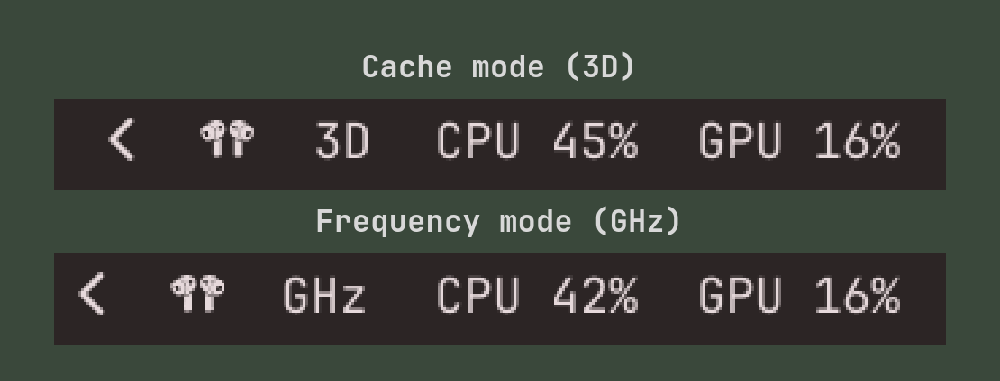

# Omarchy X3D Mode

An Omarchy bar widget for switching the Linux AMD X3D scheduler preference
between the cache CCD and the frequency CCD.

- `3D` means the cache CCD is preferred.
- `GHz` means the frequency CCD is preferred.
- Left-click switches modes using a Polkit authorization prompt.
- Right-click refreshes the displayed state.



## Screenshots

| Cache CCD preferred | Frequency CCD preferred |
| --- | --- |
|  |  |

## Requirements

- Omarchy with the Quickshell-based bar
- A supported dual-CCD AMD Ryzen X3D processor
- The `amd_x3d_mode` sysfs interface at
  `/sys/devices/platform/AMDI0101:00/amd_x3d_mode`

## Installation

```bash
omarchy plugin add https://github.com/xela-io/omarchy-x3d-mode.git --enable --yes
```

### Optional: switch without a password prompt

By default every switch asks for authorization through Polkit. To skip the
prompt, install the small helper from the plugin directory:

```bash
./helper/install.sh
```

This installs `/usr/local/bin/omarchy-x3d-mode-set`, which only accepts
`cache` or `frequency`, and a Polkit action that lets the active local session
run it without a password. Remote and inactive sessions still need admin
authentication. The widget uses the helper automatically when it is present.

To remove it again:

```bash
./helper/install.sh --remove
```

## Removal

Remove the optional helper first if you installed it, then:

```bash
omarchy plugin remove xela.x3d-mode --yes
```
